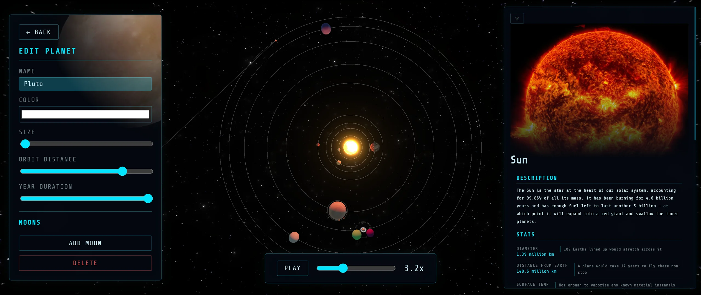
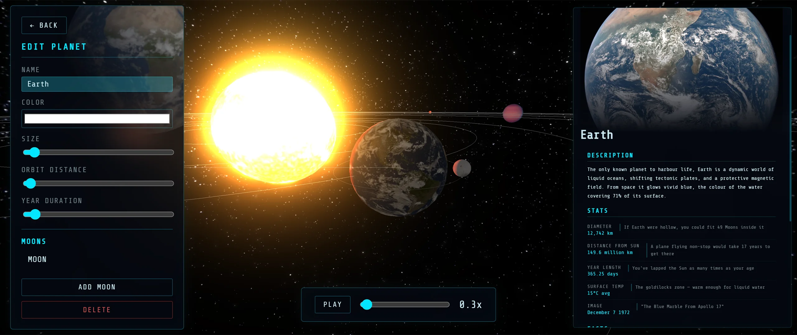
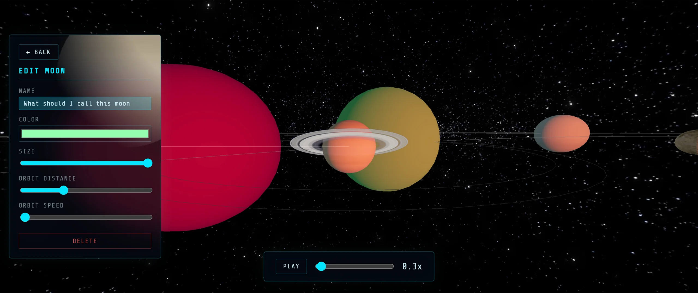

# Orbit

An interactive 3D model of the solar system built with Three.js — created as part of a project to help kids get curious about space. Best experienced on a desktop.

🌐Automatically deployed via github actions version available on my site. **https://orbit.tanelneitov.eu**


---
## Features

### Core
- Planet sizes and orbital distances are proportionally scaled to preserve relative relationships while keeping everything visible.
- Real planet textures with rotation
- Hover over a planet or orbit ring to see its name, size, and distance from the sun
- Full simulation speed control: pause, play, slow down, or speed up

### Planet & Moon Editor
- Add, edit, and delete planets and moons
- Adjust name, size, colour, orbital speed, and distance from the Sun
- Moons support all the same controls as planets

### Extra planet Info Panel
Clicking on any planet opens an info panel with a hero image, a short description, and a stats section with relatable comparisons — designed to make the numbers mean something. For example, rather than just listing Jupiter's diameter, it tells you that 11 Earths could fit side by side across it.

Includes entries for all 8 planets, plus Pluto and the Sun.

## Controls

| Action | Control |
|--------|---------|
| Orbit camera | Click and drag |
| Zoom | Scroll wheel |
| Focus on planet | Click a planet |
| Simulation speed | Bottom slider |
| Pause / Play | Bottom button |


### Bonus
- Cinematic intro camera animation on load
- Bloom post-processing for a sleek glow effect
- 3D Starfield and a star skybox
- Saturn's rings
- Info Panel

## Screenshots
<details>
<summary>Click for screenshots</summary>
<table>
<tr>
<td></td>
<td></td>
</tr>
<tr>
<td></td>
<td></td>
</tr>
</table>
</details>


## Tech Stack

- [Three.js](https://threejs.org/) - 3D rendering
- [Vite](https://vitejs.dev/) - build tool
- Vanilla JS and CSS - no UI framework or component library

## Deployment

Deployed automatically to [Zone.eu](https://www.zone.eu) via GitHub Actions on every push to `main`.  
Thank you to [kood//](https://kood.tech/en/) and [Zone](https://www.zone.eu) for providing the domain!

### Prerequisites
- Node.js 22+

### Local Deployment

Run local
```bash
npm install
npm run dev
```

### Build & Preview
(Building the project improves performance)

```bash
npm install
npm run build
npm start
```

> `npm start` will error if the project hasn't been built yet.

---

## Authors

- [@tanelerikneitov](https://www.github.com/DreXtrime)


